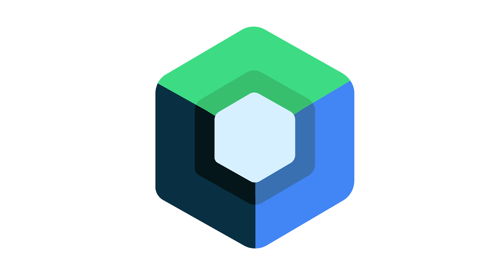

Welcome to the Declarative UI Docs. The goal of this documentation is to make switching between declarative ui frameworks easy. It is also helpful to compare different concepts and similarities to learn from each other.

# What is declarative ui

Declarative UI is an approach to building user interfaces that focuses on describing what the interface should look like, rather than the step-by-step process of how to create it. In this paradigm, developers define the desired end result, and the underlying framework or library takes care of rendering the UI based on that description.

With declarative UI, developers express the UI in terms of a set of components and their properties. These components can be nested and composed together to create complex interfaces. Rather than manually manipulating the UI elements, developers simply declare the desired state, and the framework handles the updates and re-rendering.

One of the key advantages of declarative UI is its ability to provide a clear separation between the UI logic and the application state. This makes it easier to reason about and maintain the codebase. Additionally, since the framework handles the rendering optimizations, it can automatically handle UI updates efficiently, resulting in improved performance.

Declarative UI has gained popularity in recent years, with frameworks like React and SwiftUI leading the way. These frameworks enable developers to create UIs for web and mobile applications using a declarative approach. By leveraging the power of declarative UI, developers can build interfaces more efficiently, iterate faster, and create more robust applications.

# Overview of different frameworks

## React
React is an open-source JavaScript library for building user interfaces. It enables developers to create reusable UI components that can be composed together to construct complex interfaces. React uses a virtual DOM to efficiently update and render UI components, optimizing performance. Its unidirectional data flow ensures predictable code, with data flowing from parent to child components via props. With a large and active community, React is widely adopted and supported, making it a popular choice for building interactive and dynamic web applications.

## SwiftUI
SwiftUI is a modern declarative framework developed by Apple for building user interfaces across Apple platforms. It allows developers to create robust and visually appealing apps using a simple and intuitive syntax. SwiftUI utilizes a declarative approach, enabling developers to describe the desired UI and state, while the framework handles the underlying complexities. It provides a wide range of built-in components and layout options, facilitating rapid app development. SwiftUI is designed to work seamlessly with the Swift programming language and leverages the power of SwiftUI’s live previews for real-time UI development and testing. With its strong integration with other Apple frameworks and tools, SwiftUI offers a streamlined and efficient way to build engaging user interfaces for iOS, macOS, watchOS, and tvOS.

## Jetpack Compose
Jetpack Compose is a modern UI toolkit developed by Google for building native Android applications. It enables developers to create dynamic and interactive user interfaces using a declarative and composable approach. With Compose, developers can express the UI hierarchy and behavior as a function of the current state, simplifying UI development. It provides a wide range of customizable and reusable components, allowing for rapid prototyping and iteration. Jetpack Compose seamlessly integrates with existing Android codebases and supports live previews, enabling real-time UI development and testing. It offers improved performance and productivity compared to traditional Android UI frameworks, making it a powerful tool for building beautiful and responsive Android apps.

## Flutter
Flutter is an open-source UI toolkit developed by Google for building natively compiled applications for mobile, web, and desktop platforms. It uses a single codebase to create visually appealing and performant user interfaces. Flutter follows a reactive and declarative programming model, allowing developers to build UIs by composing widgets. It offers a rich set of customizable and pre-built widgets, enabling fast and efficient development. Flutter’s hot reload feature allows developers to see changes instantly, enhancing the development experience. With its high-performance rendering engine, Flutter delivers smooth and native-like experiences across multiple platforms, making it a popular choice for cross-platform app development.

# Detailed comparison 

* [Elements](./docs/elements) 
* [Composing](./docs/composing)
* [Structuring](./docs/structure)